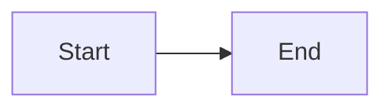

:::figure{src="/media/a.png" alt="A figure, &quot;quoted&quot;"}
A caption with *emphasis*.
:::

:::chart{type=bar x=name y=value_kib title="Sizes" alt="Bar chart"}
```csv
name,value_kib
first,1
```
An optional caption.
:::

:::diagram{title="" alt="Flow"}

:::

::::details{summary="Outer"}
:::sidenote
Nested directive.
:::
::::

::leaf[label]{#id .class}

Text with :pullquote[a raised line] and :swatch[#4F2D7F] inline, a ratio of 4.5:1 and localhost:8080.

Inline math $E = mc^2$ and a block:

$$
\int_0^1 x\,dx
$$

Prices like $5 and $10 in one line.
